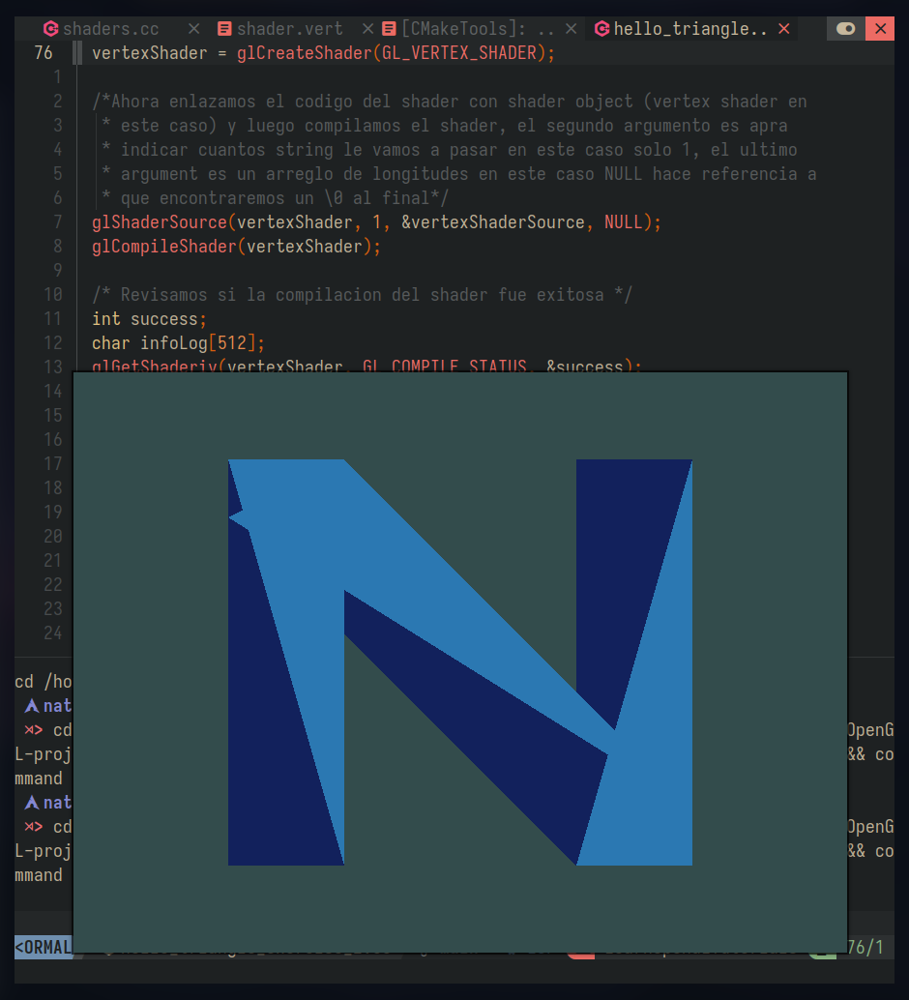

# OpenGL Learning

This repository contains my first steps learning **OpenGL**.  
Each exercise focuses on basic concepts such as shaders, transformations, and rendering primitives.

I use this tutorial for learning:
- [LearnOpenGL](https://learnopengl.com)

---

## 🔺 Project 1: Rotating Triangle with Interpolated Colors

- Implemented a triangle using a **vertex shader** and **uniforms**.  
- Applied a **rotation matrix** to animate the triangle.  
- Colors are **interpolated smoothly** across vertices.

📹 Demo video:

[▶️ Watch demo](screenshots/triangle.mp4)

---

## 🅽 Project 2: Letter "N" with Multiple Triangles

- Created the letter **N** using several triangles.  
- Practiced positioning, scaling, and organizing vertices.  

🖼️ Screenshot:



---

## 🛠️ Tech Stack
- **C++**
- **OpenGL (GLAD + GLFW)**
- **GLSL Shaders**

---

## 🚀 How to Run
1. Clone the repository
   ```bash
   git clone https://github.com/Natzgun/LearnOpenGL.git
   ```
